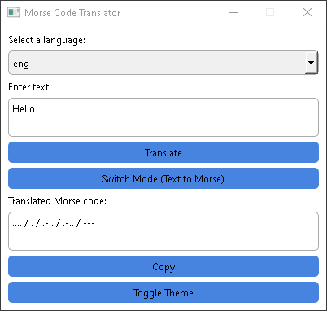
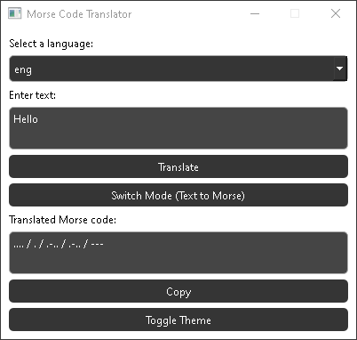

# Morse Code Translator

Morse Code Translator is a simple GUI application built with Python and PyQt6 that allows you to translate text to Morse code and vice versa. It supports English and Russian languages.

## Features

- Translate text to Morse code
- Translate Morse code to text
- Switch between "Morse to Text" and "Text to Morse" modes
- Choose the language (English or Russian)
- Copy translated text to clipboard
- Toggle between light and dark themes

## Installation

1. Clone the repository:

`git clone https://github.com/Jesewe/Morse-Code-Translator.git`

2. Change into the project directory:

`cd Morse-Code-Translator`

3. Install the required dependencies:

`pip install -r requirements.txt`

4. Run the application:

`python main.py`

## Usage

1. Choose the language (English or Russian) from the drop-down menu.
2. Enter the text or Morse code you want to translate.
3. Click the "Translate" button to get the translation.
4. If you want to copy the translated text, click the "Copy" button.
5. To switch between "Morse to Text" and "Text to Morse" modes, click the "Switch Mode" button.
6. You can also toggle between light and dark themes by clicking the "Toggle Theme" button.

## Screenshots

Light Theme:

Dark Theme:

## License

This project is licensed under the MIT License. See the [LICENSE](LICENSE) file for more information.